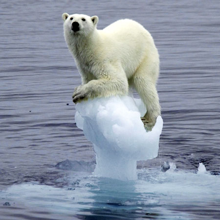
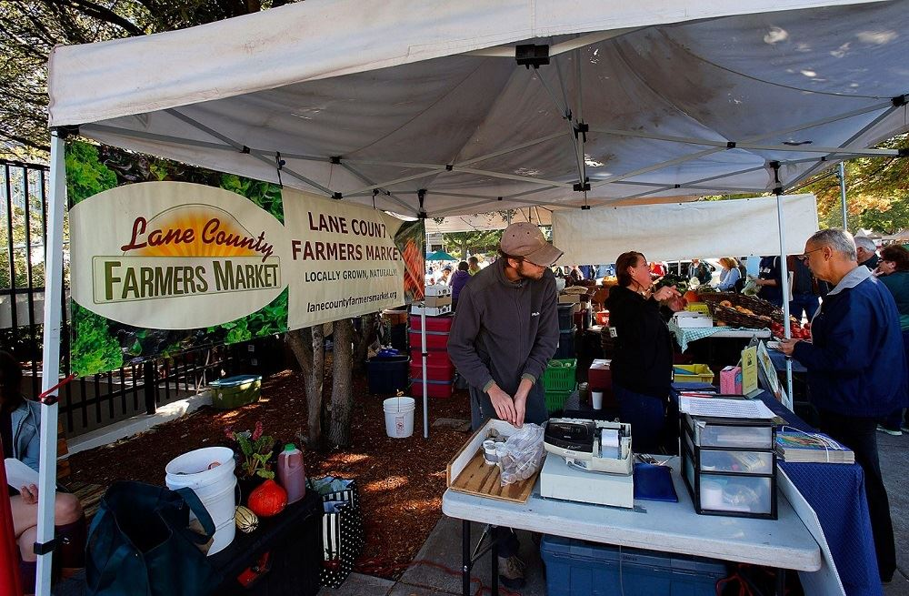
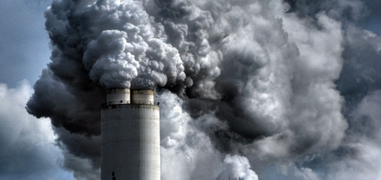
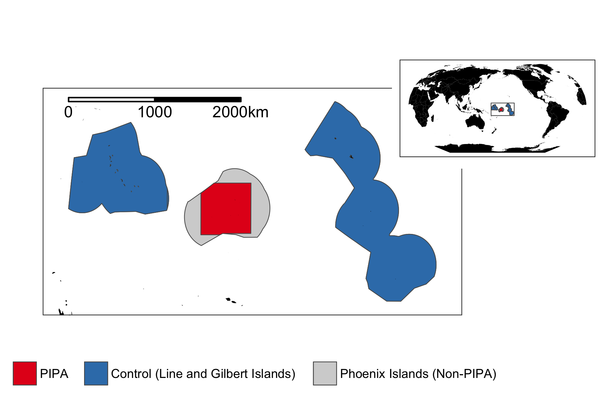
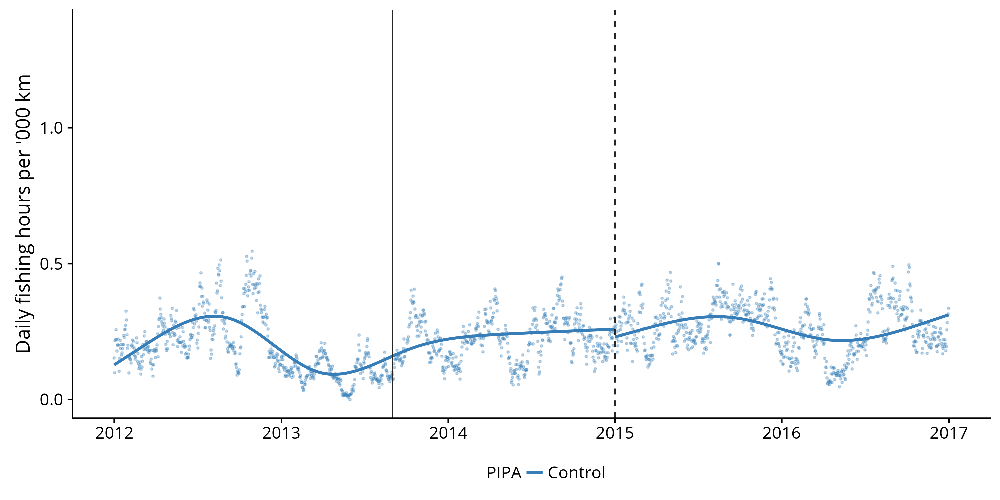
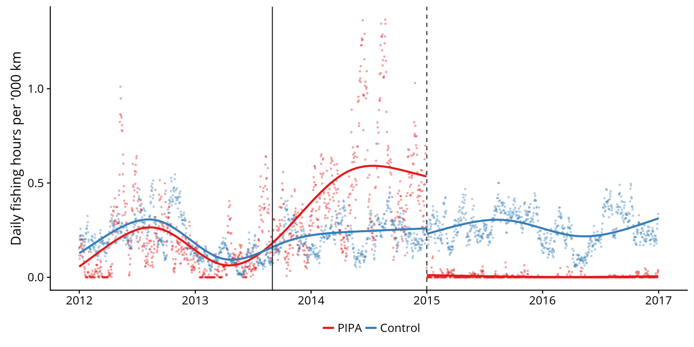
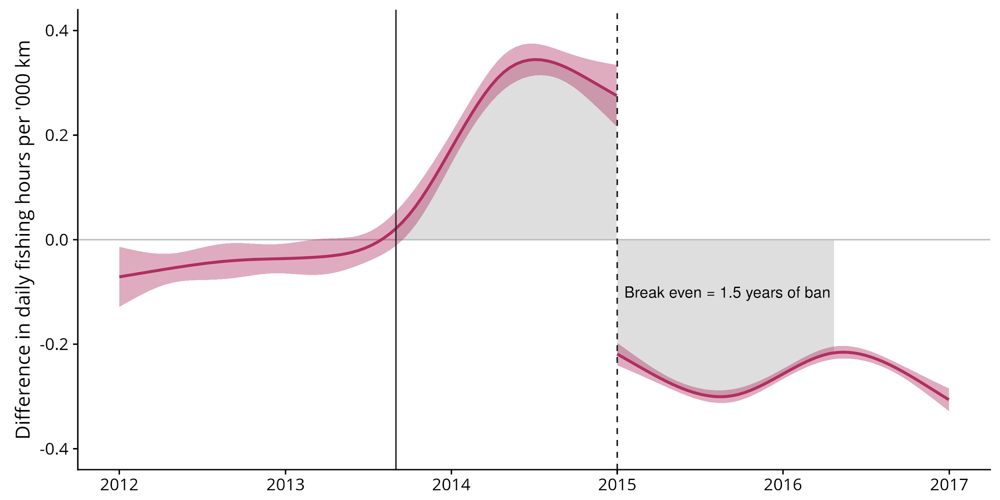
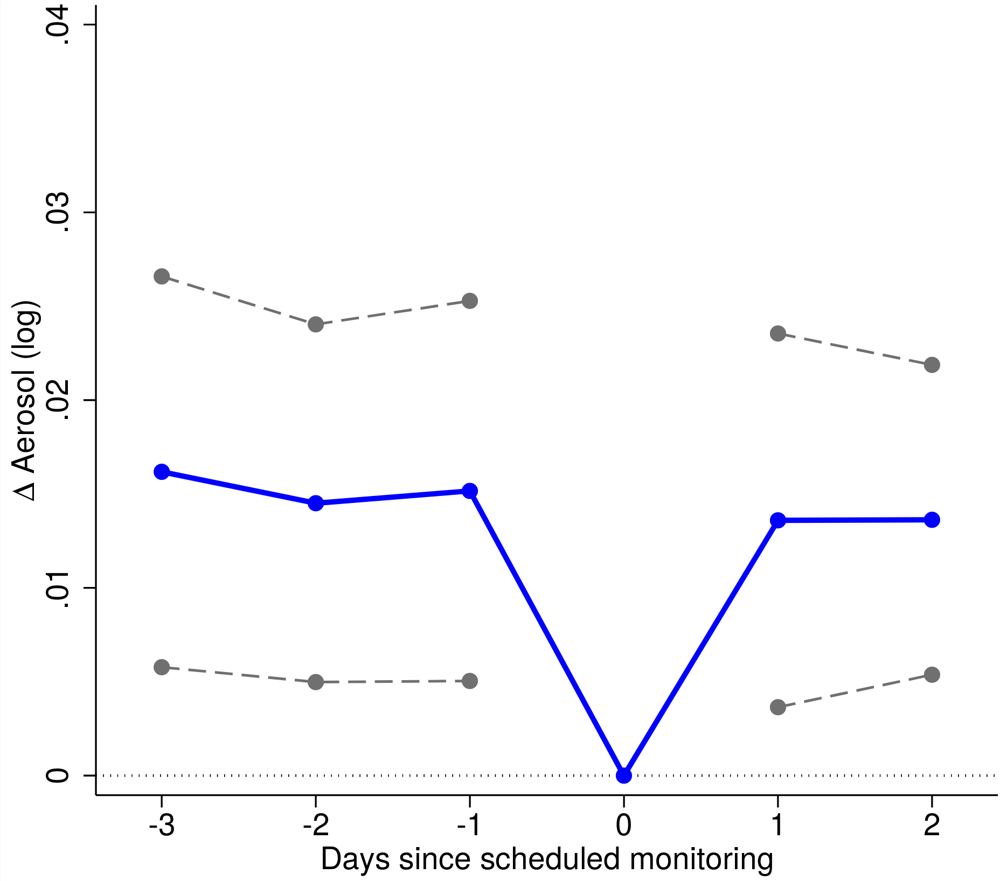

```{r xaringan-themer, include=FALSE, warning=FALSE}
library(xaringanthemer)
style_mono_light(base_color = "#23395b", link_color = "#F97B64")
```

```{r xaringan-scribble, echo=FALSE}
xaringanExtra::use_scribble()
```

```{r setup, include=FALSE}
options(htmltools.dir.version = FALSE)
```

```{r global_options, include=FALSE, cache=FALSE}
library(knitr)
opts_chunk$set(
  fig.align="center", fig.width=8, fig.height=6, #fig.path='pics/',
  cache=T,
  echo=F, warning=F, message=F
  )
```

## About me

--


---

## Goals for today

1. Introduce you to some key ideas in environmental economics.

2. Show you some of the stuff that I am working on.

3. Answer any questions that you might have.

---
class: inverse, center, middle

# Some questions

---

## How much is a polar bear worth?



---

## Is it good to "buy local"?



---

## If fighting pollution is expensive, can we have too little pollution?



---
class: inverse, center, middle

# Common-pool resources game

---

## Common-pool resources game

(We'd normally do this live, in class. But [here's a game](https://economics-games.com/tragedy-commons) for you try in groups once you watch this lesson. After that, watch the short video below to get deeper sense of what's happening...) 

.center[
<iframe width="560" height="315" src="https://www.youtube.com/embed/CxC161GvMPc" frameborder="0" allow="accelerometer; autoplay; clipboard-write; encrypted-media; gyroscope; picture-in-picture" allowfullscreen></iframe>
]

---
class: inverse, center, middle

# "The Blue Paradox"

---

## Watching a marine reserve in real time

<center>
<video width="480" height="360" controls>
  <source src="pics/pipa-zoom.mp4" type="video/mp4">
</video>
</center>

.footnote[
<a href="http://globalfishingwatch.org/map/?redirect_login=true" target="_blank">Live session</a>.
]

---

## Motivation for the project

- You are about to lose access to your preferred fishing ground. 
  - Someone is about to take away all your fish / eat the rest of the birthday cake / etc.

- What do you do?

--

- My answer: "Catch all the fish while I still can!"

---

## Global Fishing Watch

- GFW is a joint project started by Google and some non-profit organisations.

- Offers unprecedented insight into *global* fishing activity.
  - Includes otherwise inaccessible locations.
  
- GFW want to encourage citizen science and engagement. Anyone can look at the GFW data through their ([interactive map](http://globalfishingwatch.org/map/)).
  - Fun fact: The graphics technology used to power the map is the same used in leading video games like *World of Warcraft*, etc.

---

## A lot of data...


---

## Cool use of machine learning


---


## Back to the Blue Paradox

- Focus on the Phoenix Island Protected Area (PIPA).
  - A big marine reserve in the central Pacific, about the size of California!



---

## Main result (1)

</br>
</br>


---

## Main result (2)

</br>
</br>


---

## Main result (3)

</br>
</br>


---

## Summary

- Fishermen more than *doubled* their fishing effort in the lead up to PIPA.
  - Equivalent to 1.5 years of banned fishing.

- Even well-intentioned policies can lead to bad outcomes.
  - Especially if we ignore human behaviour and incentives... the role of economics!

---

## Other, ongoing GFW projects

- There are numerous other, ongoing GFW projects that I'd be happy to talk about afterwards.

  - E.g. Connecting overfishing and human-rights abuses on the high seas. ([Link](https://globalfishingwatch.org/research/forced-labor-in-fisheries/).)


---

class: inverse, center, middle

# Other projects

---

## Google Earth Engine

- <a href="https://code.earthengine.google.com/6ab2cce9a768f97d613b53b80155aef0">Live session</a>.

???

- FWIW, here's a GEE script for the <a href="https://code.earthengine.google.com/21c101d3d1aa7a5ac083c9bd6cd19f8c" target="_blank">Blue Paradox</a> using GFW data.

---

## More environmental economics at UO

- [Trudy Cameron](https://pages.uoregon.edu/cameron/vita/)

- [Ed Rubin](http://edrub.in/index.html)

- [Eric Zou](http://www.eric-zou.com/)

- [TWEEDS](https://tweeds.io/)!

---

## Ex: Local air pollution & incentives

```{r, echo=FALSE, out.width="65%", fig.cap="Zou (2021, AER)."}

```

---
class: inverse, center

</br></br></br></br></br></br>

## Thank you!

### Questions?

